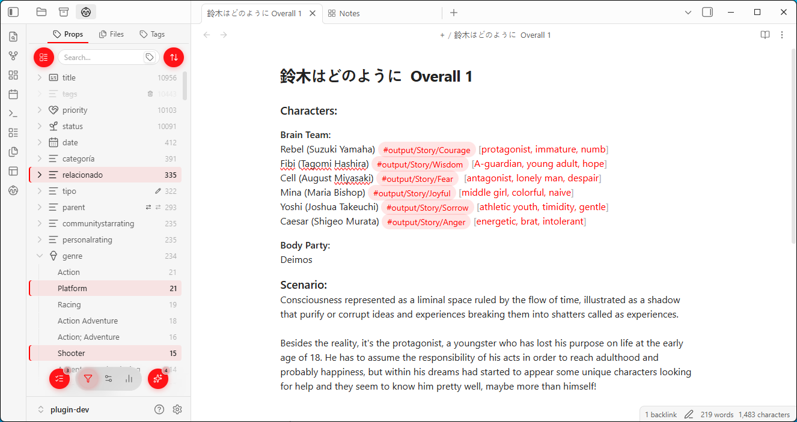
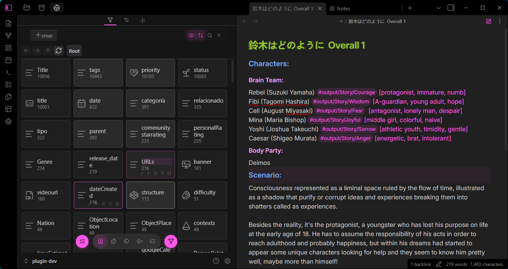
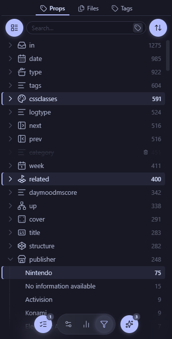
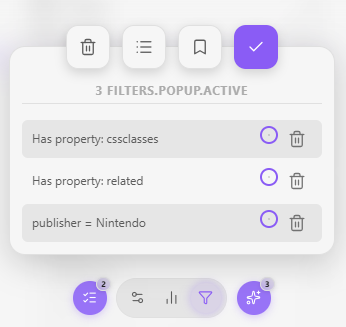
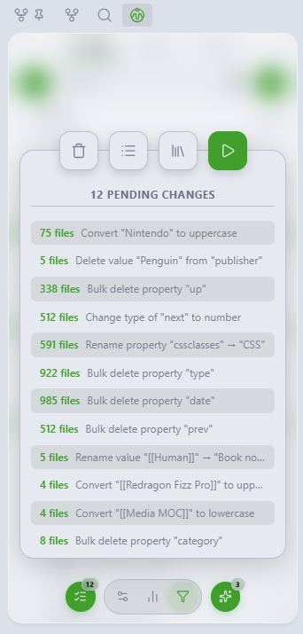
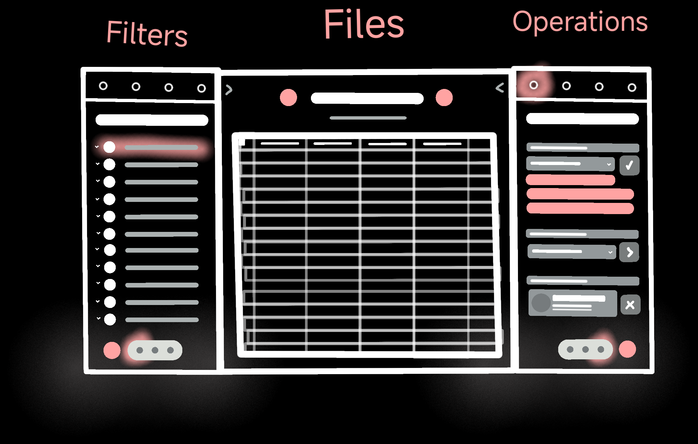

# VaultMan


 


Vaultman is a Swiss Army Knife of Obsidian tools for files management and organization at scale with scopes. Once you have hundreds of notes, the built-in properties view gets limiting fast: you can see your tags and properties listed, rename them one at a time, and that's about it.

This plugin gives you a **control panel for your data**, imitating the functionality of your system explorer with the power of Obsidian Bases. You can filter your files, select what you care about, queue up a batch of operations (*add, rename, delete, replace properties/values, move files, copy files, etc.*), preview exactly what they will change and apply everything at once (queue and filters templates will come soon).

I designed this plugin for myself, looking for a workflow that helps me with **organizing my vault** without the burden of too many plugins scattered around and disconnected from each other, in a way that would let me manage thousands of notes with hundreds of properties effortlessly every time I want to change or move something. Hope it helps you too!

# Table of Contents
- [Installation](#installation#via--brat)
- [Features](#features#main-hub)
- [Development](#development)
- [License](#license)

## Installation

Main workflow is already usable and will help you to decrease some repetitive processes. Although there are some placeholders of functionalities that will be delivered in the upcoming versions.  **Stay tuned!.**
### Obsidian Community Plugins
You can browse this plugin from the Community Plugins as: "**Vaultman**" to start using it! Or you can go and take a look into the community webpage *to see its overall score*, ranking and stats at: [Obsidian Community Page]()

Only stable version releases will be shown in the official Obsidian Community Plugins (*those without "beta" suffix*).

### Via BRAT
I'll also release experimental "beta" versions for those who want to check the project progress and for PC/Mobile testing.
1. Install [BRAT](https://github.com/TfTHacker/obsidian42-brat) from the community plugins store
2. In BRAT settings → **Add Beta Plugin**
3. Enter `meibbo/vaultman`
4. Enable **Vaultman** in Settings → Community Plugins


Beta versions are more prone to bugs and performance issues, and can break your vault. Use them at your own risk, and always make backups before updating or using them.
> *This project is in an early state, developing feedback is totally welcomed!*


## Features

### Plugin sidebar Frame

The main interface is a compact and modular sidebar (can also live in the main workspace) that lets you choose its content depending of what you want to edit or visualize (**Frontmatter, Files, Tags or Content**).

With a bottom dock to navigate between pages and a top bar for their subpages/tabs.

It also has FAB buttons that opens menus for quickly navigation between overlays: 

- **View menu** (how the nodes are arranged in the explorer)
- **Sort menu** (how they are sorted and grouped)
- **Active filters** (which nodes rules over file display)
- **Queue list** (which actions over files are ready to be processed)
***

### Explorers


**What makes them special**. These components are scrollable, searchable, selectable, draggable (WIP) and can be filtered based on your needs.

They are a generic and adapts to any data provider configured to show fetched data from different sources within Obsidian and converts them into **node elements.**

> Such as icons, labels, content (WIP), operation badges, highlights, counters, etc.

(*currently only available tree and grid views.*)
*** 
### Main page

*It is called filters now, but will be changed to something more generic*

This is where the explorers live, from here **you can filter out** the exact options you wanted to select for **different kinds of operations**.

- **Properties tab**: a live scrollable list of every property and value in your vault, built from the frontmatter index.

- **Files tab**: a list of the files and folders of your vault, affecting the amount of elements showed based on your active filters  

- **Tags tab**: a tree list that gives you power to rearrenge your tags and set them in the frontmatter of your notes

> Every explorer has a toolbar with a search box, sorts and different views to facilitate your navigation and only will affect each tab individually
***
### Filters & Operations
A **node** will be any of the options that are listed from the provider data of the selected tab (*even snippets, plugins and layouts will have their own tabs!*)

Every selected node will apear in the **Active filters island**, where you can strategically add logical groups (*and/or/none*), supress filters, clear all, or even select templates of filters(WIP) to scope down the exact nodes you wanted to edit.


> This versions only scopes the files tab from selected properties, tags or content. *Showing content or metadata from selected files will be added soon.*
***
#### Queue changes
Every action of edition of any node will be stored by default on the queue changes list, let's you preview exactly what they will change and apply everything at once


***
### Stats / Homepage / Tools

For now, is just a simple dashboard placeholder that will gradually become into widgets that fetch general vault statistics.

Also (in beta version), it has an option that let's you choose any file as your sidebar homepage (useful in mobile, because there's not an easy way YET to put notes or bases in your sidebars)

The tools page is currently mostly a stub with the Find and Replace (tabContent.svelte) and a mock menu curator panel (to sanitize your context menus when they reach absurd amounts of options). There will live tools that supercharge obsidian, like Linter (with scopes), Layouts, Snippets, Plugins, etc.

---
## Development



I'll be working on the branches: **Main**, **Dev** and **Sandbox** (my favourite), any issue/suggestion/pull request is welcome!

```bash
git clone https://github.com/Meibbo/VaultMan
cd VaultMan
```
This project has at least 65% of coverage with unit tests (*still in sandbox branch*), CI/CD, GitHub Actions, CodeQL and smoke tests.

The file operations (and other internal functions) has been tested in a 10k notes vault without issues, but performance has work to be done.

>*I'm committed to this project so expect more frequent updates and features coming your way!.*
***
### Roadmap

- [ ] Increase explorers performances using memory snapshots and/or indexing
- [ ] Add logic groups for filters for better scoping
- [ ] Sticky rows for tree views
- [ ] Keyboard and enhanced mouse/touch navigation support
- [ ] Add groups and manual sorting for all explorers
- [ ] Release official Node-Notes feature (*every concept deserves its note*)
- [ ] Marks and templates for automation and quick navigation
- [ ] Drag&Drop operations

### Built With

This project uses the following open-source technologies:

- TypeScript
- Svelte
- TanStack
- DnD-Kit
- UnoCSS
- Bits UI
- PretextJS (experimental)

All third-party libraries retain their respective licenses.

## License

[MIT](LICENSE) — [Meibbo](https://github.com/Meibbo). This product is published *as it is* without any explicit warranty due to its early development state. 

> **Disclaimer**: *AI agentic tools were used in the making of this plugin, and was only published after being manually tested and debugged since March 2026*

*Built for me, for you, and for better tools that lets us make more with less effort.*
