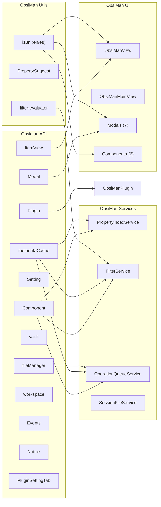
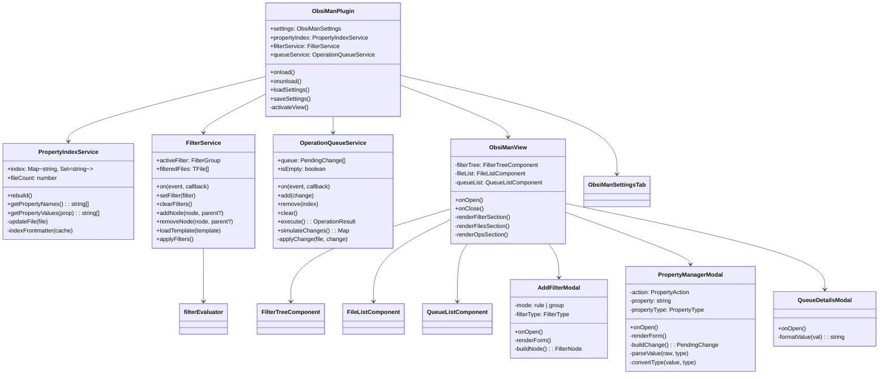
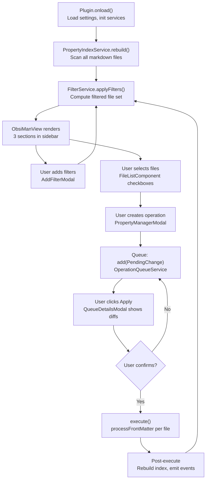

---
Category:
  - "[[Maps]]"
up:
  - "[[ObsiMan]]"
type:
  - about
description: mapa completo de cómo funciona el código del plugin de Obsidian en lenguaje TypeScript
structure:
  - toc
  - callout
  - code
  - mermaid
input:
  - AI-gen
AI-Agent:
  - "[[Claude]]"
dateCreated: 2026-03-24T00:00:00
dateModified: 2026-03-25T20:03:00
---
# ObsiMan Plugin — Design & Architecture

> [!abstract] Overview
> `obsiman` is a **full-featured Obsidian plugin** (~4,200 lines of TypeScript across 30 files) for bulk editing vault metadata. It provides boolean filter trees with saved templates, batch property operations (set, rename, delete, clean, change type, wikilink casting), a hierarchical property explorer, virtual-scrolling grid, session management with Google Drive conflict detection, linter integration, pattern-based file renaming, and a transactional queue system with enhanced diff previews — all running inside Obsidian with live access to `metadataCache` and `processFrontMatter`.
>
> This document is the single source of truth for understanding the plugin codebase. Use it as a map for navigating the TypeScript code or as a reference for extending the plugin.

---

## 1. File Map

| File | Lines | Description |
|---|---|---|
| `main.ts` | 140 | Plugin entry point — initializes 4 services, registers 2 views, commands, settings |
| `src/types/filter.ts` | 34 | Discriminated union types: `FilterNode`, `FilterGroup`, `FilterRule`, `FilterTemplate` |
| `src/types/operation.ts` | 44 | `PendingChange`, `OperationResult`, special signals (`DELETE_PROP`, `RENAME_FILE`, `REORDER_ALL`), `PropertyType` includes `wikilink` |
| `src/types/settings.ts` | 22 | `ObsiManSettings` interface + `DEFAULT_SETTINGS` (language, templates, session, gridColumns) |
| `src/types/session.ts` | — | Session-related types |
| `src/services/PropertyIndexService.ts` | 105 | Live `Map<string, Set<string>>` index from `metadataCache` with incremental updates |
| `src/services/FilterService.ts` | 93 | Boolean filter tree management + evaluation, emits `'changed'` events |
| `src/services/OperationQueueService.ts` | 185 | Pending changes queue + atomic execution via `processFrontMatter`, `simulateChanges()` for diff |
| `src/services/SessionFileService.ts` | 480+ | Session .md file lifecycle: read/write/watch/sync, Google Drive conflict detection, `getSyncStatus()` |
| `src/views/ObsiManView.ts` | 310+ | Sidebar `ItemView` — 4 sections: Explorer, Filters, Files, Operations |
| `src/views/ObsiManMainView.ts` | 250+ | Center workspace view with split-pane layout: [Explorer \| Grid], Toolbar, StatusBar |
| `src/components/FilterTreeComponent.ts` | 106 | Recursive DOM renderer for boolean filter tree |
| `src/components/FileListComponent.ts` | 235 | Checkable file list with search filtering, column sorting, pagination |
| `src/components/PropertyGridComponent.ts` | 350+ | **NEW** Virtual-scrolling spreadsheet (28px/44px row height, overscan, Shift+click range select) |
| `src/components/PropertyExplorerComponent.ts` | 210 | **NEW** Hierarchical tree: L1=property names, L2=values with file counts, click-to-filter |
| `src/components/QueueListComponent.ts` | 71 | Queue items display with remove buttons |
| `src/components/ToolbarComponent.ts` | 390+ | **NEW** Top toolbar: session picker, filter/queue popovers, sync indicator, action buttons |
| `src/components/StatusBarComponent.ts` | 60+ | **NEW** Bottom status bar with file/selection/queue counts |
| `src/modals/AddFilterModal.ts` | 210+ | Filter rule/group creator with `PropertySuggest` autosuggest on property and value fields |
| `src/modals/PropertyManagerModal.ts` | 400+ | 5-action property editor with `PropertySuggest` on all text inputs, wikilink type casting |
| `src/modals/QueueDetailsModal.ts` | 170+ | **Enhanced** Collapsible file sections, summary header, show-unchanged toggle, YAML formatting |
| `src/modals/CreateSessionModal.ts` | 80+ | Dialog for creating new session .md files |
| `src/modals/LinterModal.ts` | 230+ | **NEW** Integrates with obsidian-linter plugin, sortable property priority list |
| `src/modals/FileRenameModal.ts` | 180+ | **NEW** Pattern-based rename with {basename}, {date}, {counter}, {property} placeholders |
| `src/modals/SaveTemplateModal.ts` | 85+ | **NEW** Save current filter tree as named template to settings |
| `src/settings/ObsiManSettingsTab.ts` | 86 | Settings UI: language, default type, filter template management |
| `src/utils/filter-evaluator.ts` | 168 | Pure function `evalNode()` — recursive set arithmetic for filter evaluation |
| `src/utils/autocomplete.ts` | 51 | `PropertySuggest` — `AbstractInputSuggest` wrapper for fuzzy property/value autosuggest |
| `src/i18n/index.ts` | 34 | `t(key, vars?)` translation function with fallback chain |
| `src/i18n/en.ts` | 155+ | English translations (~150 keys) |
| `src/i18n/es.ts` | 155+ | Spanish translations (~150 keys) |
| `styles.css` | 900+ | CSS with `--obsiman-*` variables, explorer tree, virtual scroll, diff, mobile responsive |

---

## 2. Core Foundations



> [!info] Key Difference from Python Version
> The plugin eliminates the entire `CacheManager` + pickle cache layer. Obsidian's `metadataCache` provides live-indexed frontmatter for all markdown files, with change events for incremental updates. `processFrontMatter()` handles atomic YAML writes without corrupting file body content.

---

## 3. Core Data Structures

### 3A. Property Index — `PropertyIndexService.index`

A live `Map<string, Set<string>>` mapping every known property name to its observed values:

```typescript
// Map structure
Map {
    "type" => Set { "about", "event", "index", "task", "log" },
    "tags" => Set { "idea", "project", "daily" },
    "Category" => Set { "[[Maps]]", "[[Projects]]", "[[Persons]]" }
}
```

### 3B. Filter Tree — `FilterService.activeFilter`

A recursive boolean tree using discriminated unions:

```typescript
{
    type: 'group',
    logic: 'all',       // 'all' (AND) | 'any' (OR) | 'none' (NOT)
    children: [
        {
            type: 'rule',
            filterType: 'has_property',
            property: 'type',
            values: []
        },
        {
            type: 'group',
            logic: 'any',
            children: [...]
        }
    ]
}
```

> [!tip] Filter types
> `has_property`, `missing_property`, `specific_value`, `multiple_values`, `folder`, `folder_exclude`, `file_name`, `file_name_exclude`

Evaluation uses `evalNode()` — recursive set arithmetic (intersection for AND, union for OR, complement for NOT).

### 3C. Pending Changes Queue — `OperationQueueService.queue`

A sequential array of staged operations:

```typescript
interface PendingChange {
    property: string;           // Property name
    action: PropertyAction;     // 'set' | 'rename' | 'delete' | 'clean_empty' | 'change_type'
    details: string;            // Human-readable description
    files: TFile[];             // Target files
    logicFunc: (               // Per-file transform function
        file: TFile,
        metadata: Record<string, unknown>
    ) => Record<string, unknown> | null;
    customLogic: boolean;
}
```

> [!warning] Special return keys
> - `_DELETE_PROP` — signals the executor to delete a property after writing
> - `_RENAME_FILE` — signals a file rename instead of property write
> - `_REORDER_ALL` — signals frontmatter key reordering

### 3D. Settings — `ObsiManSettings`

```typescript
interface ObsiManSettings {
    language: 'en' | 'es';
    defaultPropertyType: string;   // 'text' | 'number' | 'checkbox' | 'list' | 'date'
    filterTemplates: FilterTemplate[];
}
```

Persisted via `plugin.saveData()` → `.obsidian/plugins/obsiman/data.json`.

---

## 4. Class Hierarchy



---

## 5. UI Layout

### 5A. Sidebar View (ObsiManView)

```
┌──────────────────────────────┐
│ ObsiMan (sidebar)            │
├──────────────────────────────┤
│ PROPERTIES (Explorer)        │
│ [Search properties...]       │
│ ▸ type (1,204)              │
│ ▸ tags (892)                │
│ ▾ Category (456)            │
│   [[Maps]] (120)            │
│   [[Projects]] (89)         │
├──────────────────────────────┤
│ FILTERS                      │
│ [Template ▼] [Save] [Clear] │
│ [+ Filter] [Refresh]        │
│ ├─ ALL (AND)                 │
│ │  ├─ Has property: type     │
│ │  └─ In folder: +/         │
├──────────────────────────────┤
│ FILES                        │
│ 342 / 1,204 files            │
│ [Search files...]            │
│ ☑ Note.md      5       +/   │
│ ☐ Post.md      3       +/   │
├──────────────────────────────┤
│ OPERATIONS                   │
│ [Properties] [Linter]        │
│ [Rename Files]               │
│ Queue (2 pending):           │
│  1. set  tags = idea (42 f.) │
│  2. rename status→... (10 f.)│
│ [Apply] [Clear queue]        │
│ 1,204 files · 87 properties  │
└──────────────────────────────┘
```

### 5B. Main View (ObsiManMainView)

```
┌─────────────────────────────────────────────────────────┐
│ [Session ▼] ● [Filters▼] [Queue▼] [Explorer] │ [Props] [Linter] [Rename] [Apply] │
├──────────┬──────────────────────────────────────────────┤
│ Explorer │  Virtual-Scrolling Property Grid              │
│ ▸ type   │  ☑ Name      type    tags    in     up       │
│ ▸ tags   │  ☐ Note.md   about   idea    PKM    System   │
│ ▾ Categ  │  ☐ Post.md   event   daily   Blog   -        │
│  Maps    │  ☐ Log.md    log     -       Jour   -        │
│  Proj    │  ... (virtual scroll, 28px rows, 60fps)      │
├──────────┴──────────────────────────────────────────────┤
│ 342 / 1,204 files │ 5 selected │ 2 queued              │
└─────────────────────────────────────────────────────────┘
```

> [!note] Section methods
> - **Explorer**: `PropertyExplorerComponent` — hierarchical tree with PropertySuggest search, click-to-filter
> - **Filters**: `renderFilterSection()` / filter popover — template dropdown, save/clear, `FilterTreeComponent`
> - **Files**: `renderFilesSection()` — search, bulk select, `FileListComponent` / `PropertyGridComponent`
> - **Operations**: `renderOpsSection()` — property manager, linter, rename buttons, `QueueListComponent`, apply/clear
> - **Toolbar**: `ToolbarComponent` — session picker, sync indicator, filter/queue popovers, action buttons
> - **StatusBar**: `StatusBarComponent` — file counts, selection count, queue count

---

## 6. Execution Lifecycle



> [!important] No threading needed
> Unlike the Python version which uses `threading.Thread` + `root.after()` to keep the UI responsive, the plugin uses `async/await` natively. Obsidian's event loop handles all concurrency — `processFrontMatter()` is already async.

---

## 7. I18N System

The bilingual system lives in `src/i18n/`:

- **`en.ts`** / **`es.ts`** — flat `Record<string, string>` dictionaries with ~100 keys each
- **`t(key, vars?)`** — lookup function with placeholder interpolation and English fallback
- **`setLanguage(lang)`** / **`getLanguage()`** — runtime language switching

> [!example] Usage
> ```typescript
> import { t } from '../i18n/index';
>
> header.createEl('h4', { text: t('section.filters') });
> // → "Filtros" (es) or "Filters" (en)
>
> const msg = t('files.count', { filtered: 342, total: 1204 });
> // → "342 / 1,204 archivos" (es) or "342 / 1,204 files" (en)
> ```

Fallback chain: `currentLang → English → raw key`.

---

## 8. Services Deep Dive

### 8A. PropertyIndexService

**Purpose**: Build and maintain a live index of all frontmatter properties across the vault.

**Replaces**: Python's `CacheManager` class + `available_properties` dictionary + `.obsidian_properties_cache.pkl` file.

| Method | Purpose |
|---|---|
| `rebuild()` | Full scan of all markdown files via `vault.getMarkdownFiles()` |
| `updateFile(file)` | Incremental update on `metadataCache.on('changed')` |
| `indexFrontmatter(cache)` | Extract property keys/values, skip Obsidian's internal `position` key |
| `getPropertyNames()` | Sorted property names for autocomplete dropdowns |
| `getPropertyValues(prop)` | Sorted values for a given property (autocomplete) |

**Event listeners**:
- `metadataCache.on('changed', file)` → incremental index update
- `vault.on('delete', file)` → full rebuild (simpler than tracking per-file contributions)

### 8B. FilterService

**Purpose**: Manage the active filter tree and compute the filtered file set.

**Custom events**: Emits `'changed'` whenever filtered results update.

| Method | Purpose |
|---|---|
| `setFilter(filter)` | Replace entire filter tree |
| `clearFilters()` | Reset to empty root group |
| `addNode(node, parent?)` | Add child to root or specific group |
| `removeNode(node, parent?)` | Remove node from parent group |
| `loadTemplate(template)` | Deep-clone and apply saved template |
| `applyFilters()` | Re-evaluate all files, emit `'changed'` |

**Filter evaluation**: Delegates to `evalNode()` in `filter-evaluator.ts` — a pure function that receives the filter tree, file universe, and a metadata accessor function.

### 8C. SessionFileService

**Purpose**: Manage session .md files for persisting filter/selection state across sessions.

**Session format**: `.md` files with `obsiman-session: true` frontmatter and task-list body (`- [x] [[NoteName]]`).

| Method | Purpose |
|---|---|
| `getSessionFiles()` | Find all vault files with `obsiman-session: true` frontmatter |
| `readSession(file)` | Parse task list into selected file paths |
| `writeSession(file, paths)` | Serialize selected paths as task list body |
| `getSyncStatus()` | Returns `'synced' \| 'external' \| 'conflict' \| 'none'` |
| `detectConflicts()` | Finds Google Drive conflict files via `(conflict YYYY-MM-DD)` pattern |

### 8D. OperationQueueService

**Purpose**: Stage and execute bulk property operations atomically.

**Custom events**:
- `'changed'` — queue modified (add/remove/clear/execute)
- `'executed'` — queue executed, receives `OperationResult`

| Method | Purpose |
|---|---|
| `add(change)` | Push operation to queue |
| `remove(index)` | Remove by index |
| `clear()` | Empty the queue |
| `execute()` | Re-read metadata per file, apply `logicFunc`, write via `processFrontMatter` |
| `simulateChanges()` | Dry-run: return `Map<path, {before, after}>` for diff preview |

**Special signal handling in `applyChange()`**:

```typescript
// RENAME_FILE → use fileManager.renameFile()
if (RENAME_FILE in updates) {
    await this.app.fileManager.renameFile(file, newPath);
    return;
}

// Within processFrontMatter callback:
// DELETE_PROP → delete fm[propertyName]
// REORDER_ALL → rebuild fm object in specified key order
// default → fm[key] = value
```

> [!tip] Cumulative simulation
> `simulateChanges()` chains multiple operations per file — if file A appears in operations 1 and 3, the "after" of operation 1 becomes the "base" for operation 3. This matches the Python `QueueDetailsWindow` behavior.

---

## 9. UI Components

### 9A. ObsiManView (line count: 310+)

The main sidebar view, extending `ItemView`. Orchestrates four sections: Explorer, Filters, Files, Operations.

**Lifecycle**:
- `onOpen()` → render sections, subscribe to service events
- `onClose()` → clear content (event cleanup handled by `register()`)

**Event subscriptions**:
- `filterService.on('changed')` → `refreshFiles()` → re-render file list + filter tree
- `queueService.on('changed')` → `refreshQueue()` → re-render queue list + stats

**Modal triggers**:
- Explorer section → `PropertyExplorerComponent` → click-to-filter values
- Filter section → `AddFilterModal` / `SaveTemplateModal` → adds filter nodes / saves templates
- Operations section → `PropertyManagerModal` / `LinterModal` / `FileRenameModal` → creates queued operations
- Apply button → `QueueDetailsModal` → previews and executes

### 9B. FilterTreeComponent (line count: 106)

Recursive DOM renderer for the boolean filter tree.

**Rendering**:
- Groups: nested `<div>` with logic badge (`ALL`, `ANY`, `NONE`) and border-left indentation
- Rules: inline display with type label + detail string
- Remove buttons (×) on all nodes except root group

### 9C. FileListComponent (line count: 235)

Feature-rich file list for sidebar context.

| Feature | Implementation |
|---|---|
| Search | Case-insensitive substring match on `file.basename` |
| Column sorting | `name` (locale), `props` (frontmatter key count), `path` (parent folder) |
| Selection | `Set<string>` of file paths; Select All / Deselect All buttons |
| Pagination | `RENDER_LIMIT = 200`; "Show more" button for performance |
| Click to open | `app.workspace.openLinkText(file.path, '', false)` |

### 9D. QueueListComponent (line count: 71)

Simple list rendering of queued operations.

Each item shows: index number, action badge (colored), detail string, file count, remove button (×).

### 9E. PropertyExplorerComponent (line count: 210)

Hierarchical property tree for instant navigation.

| Feature | Implementation |
|---|---|
| Search | `PropertySuggest` fuzzy autosuggest on property names |
| Level 1 | Property name + file count badge (e.g. "type (1,204)") |
| Level 2 | Values sorted by frequency descending, with counts |
| Click-to-filter | Clicking a value adds a `specific_value` filter rule to `FilterService` |
| Expand/collapse | Tracks `expandedProps: Set<string>`, CSS toggle |

### 9F. PropertyGridComponent (line count: 350+)

Virtual-scrolling spreadsheet for the main view.

| Feature | Implementation |
|---|---|
| Virtual scroll | Fixed row height (28px desktop, 44px mobile), spacer divs, overscan buffer of 8 rows |
| Selection | `Set<string>` of file paths; Shift+click range select |
| Keyboard | Tab between cells, Enter to commit |
| Columns | Configurable from `settings.gridColumns`, header click to sort |

### 9G. ToolbarComponent (line count: 390+)

Top toolbar for the main view with popover panels.

| Feature | Implementation |
|---|---|
| Session picker | `<select>` populated from `SessionFileService.getSessionFiles()` |
| Sync indicator | Colored dot: green=synced, yellow=external, red=conflict |
| Filter popover | Toggleable panel with full `FilterTreeComponent`, template dropdown, save button |
| Queue popover | Toggleable panel with `QueueListComponent`, clear button |
| Action buttons | Properties, Linter, Rename Files, Apply |

### 9H. StatusBarComponent (line count: 60+)

Bottom status bar showing: `{filtered}/{total} files | {selected} selected | {queued} queued`.

---

## 10. Modals (7 total)

### 10A. AddFilterModal (line count: 210+)

**Mode toggle**: Rule or Group.

**If Rule**:
- FilterType dropdown (8 options)
- Property text input with `PropertySuggest` autosuggest — for property-based filters
- Value text input with `PropertySuggest` (values from selected property) — for value-based and path-based filters
- Validation: property required for property-based filter types

**If Group**:
- Logic dropdown: ALL (AND), ANY (OR), NONE (NOT)
- Creates empty group (children added later)

### 10B. PropertyManagerModal (line count: 400+)

The most complex dialog. Five actions with `PropertySuggest` autosuggest on all text inputs:

| Action | Fields | logicFunc Behavior |
|---|---|---|
| **Set / Create** | Type, value, wikilink toggle, append toggle | Set property; for lists + append: push to existing array |
| **Rename** | New name input | Copy value to new key, signal `DELETE_PROP` for old |
| **Delete** | (none) | Signal `DELETE_PROP` |
| **Clean Empty** | (none) | Signal `DELETE_PROP` only if value is null/empty/[] |
| **Change Type** | Target type dropdown | Convert value via `convertType()` |

**Value parsing by type**:
- `number` → `Number(raw) || 0`
- `checkbox` → `'true'` or `'1'` → `true`
- `list` → split on comma, trim, filter empty
- `text` / `date` → pass through

**Wikilink support**: Wraps value in `[[...]]` before queuing.

### 10C. QueueDetailsModal (line count: 170+)

Enhanced diff preview using `OperationQueueService.simulateChanges()`.

**Features**:
- Summary header: "N files · M operations"
- Operations list showing each queued operation
- Collapsible file sections (collapsed by default, expand on click)
- "Show unchanged properties" toggle for full context
- YAML-like formatting for array values > 3 items
- Progress indicator via `Notice` during execution
- For each changed property key:
  - **Deleted**: red background (`obsiman-diff-deleted`)
  - **Added**: green background (`obsiman-diff-added`)
  - **Changed**: red line (old) + green line (new)

**Actions**: Apply (closes modal, calls `execute()`) or Cancel (closes, queue preserved).

### 10D. LinterModal (line count: 230+)

Integrates with the installed `obsidian-linter` plugin.

- Reads/writes linter's `yaml-key-sort` priority order from linter plugin settings
- Sortable property list with up/down buttons and remove
- `PropertySuggest` autosuggest for adding properties to the order
- Applies linting per-file by executing `obsidian-linter:lint-file` command
- Fallback: shows warning if obsidian-linter is not installed

### 10E. FileRenameModal (line count: 180+)

Pattern-based file renaming with live preview.

- Placeholders: `{basename}`, `{date}`, `{counter}`, `{propertyName}`
- Live preview of old → new names (shows first 10 files)
- `PropertySuggest` for inserting property placeholders
- Queues `RENAME_FILE` operations for execution via queue system
- Sanitizes filenames (strips `<>:"/\|?*` characters)

### 10F. SaveTemplateModal (line count: 85+)

Saves current filter tree as a named template.

- Shows existing template names for reference
- Replaces existing template with same name, or appends
- Persists to `settings.filterTemplates` via `plugin.saveSettings()`

### 10G. CreateSessionModal (line count: 80+)

Creates new session .md files with `obsiman-session: true` frontmatter.

---

## 11. Key Patterns & Conventions

### Design Patterns

> [!warning] Bilingual codebase
> The plugin follows the same convention as the Python version — Spanish and English are mixed in commit messages, comments, and i18n keys. The `t()` layer handles all user-facing text.

- **Service + View separation**: Services hold state and logic; Views render UI and handle DOM events
- **Custom event system**: `FilterService` and `OperationQueueService` use Obsidian's `Events()` for decoupled communication
- **Component lifecycle**: All services registered as children via `addChild()` for automatic cleanup on `onunload()`
- **Queue-first execution**: Nothing writes to disk without staging in `queue` first — user must confirm via `QueueDetailsModal`
- **Pure filter evaluation**: `evalNode()` is a pure function with injected `MetadataGetter` — no `App` dependency, fully testable
- **Discriminated unions**: `FilterNode = FilterGroup | FilterRule` with `type` discriminant for type-safe pattern matching

### Obsidian API Integration Points

| API | Usage |
|---|---|
| `Plugin` | Entry point, lifecycle, settings, command registration |
| `Component` | Base class for all 3 services (lifecycle management) |
| `ItemView` | Sidebar view with `getViewType()`, `getDisplayText()`, `getIcon()` |
| `Modal` | All 3 dialog modals |
| `Setting` | Form fields in modals and settings tab |
| `PluginSettingTab` | Settings page in Obsidian preferences |
| `WorkspaceLeaf` | View management (`getRightLeaf`, `revealLeaf`, `setViewState`) |
| `metadataCache` | Property indexing + change events |
| `vault` | File enumeration + delete events |
| `fileManager` | `processFrontMatter()` + `renameFile()` |
| `Notice` | User feedback after queue execution |
| `Events` | Custom event emitter in services |
| `AbstractInputSuggest` | Base class for `PropertySuggest` fuzzy autosuggest |
| `Platform` | `Platform.isMobile` for responsive row heights (28px vs 44px) |
| `commands` | `executeCommandById()` for linter integration |

### CSS Theming

All styles use `--obsiman-*` CSS variables that derive from Obsidian's theme variables:

```css
.obsiman-view {
    --obsiman-accent: var(--interactive-accent);
    --obsiman-bg-section: var(--background-secondary);
    --obsiman-bg-hover: var(--background-modifier-hover);
    --obsiman-border: var(--background-modifier-border);
    --obsiman-diff-added: #2ea04366;
    --obsiman-diff-deleted: #f8514966;
}
```

This ensures compatibility with any Obsidian theme (dark, light, custom).

---

## 12. Python → TypeScript Migration Map

| Python (pkm_manager.py) | TypeScript (obsiman plugin) |
|---|---|
| `CacheManager` + `.obsidian_properties_cache.pkl` | `PropertyIndexService` + `app.metadataCache` (built-in) |
| `read_frontmatter(path)` | `app.metadataCache.getFileCache(file)?.frontmatter` |
| `write_frontmatter(path, meta)` | `app.fileManager.processFrontMatter(file, fn)` |
| `os.walk()` + `glob.glob()` | `app.vault.getMarkdownFiles()` |
| `threading.Thread` + `root.after()` | `async/await` (native event loop) |
| `tkinter.Toplevel` | `Modal` subclasses |
| `ttk.Treeview` with columns | HTML elements in `ItemView` + grid CSS |
| `defaultdict(set)` | `Map<string, Set<string>>` |
| `self.pending_changes: list` | `OperationQueueService.queue: PendingChange[]` |
| `pickle` persistence | `plugin.saveData()` → `data.json` |
| `os.rename()` | `app.fileManager.renameFile()` (auto-updates wikilinks) |
| `_TRANSLATIONS` dict (300+ keys) | `en.ts` / `es.ts` modules (~100 keys each) |
| `eval_node()` with Python sets | `evalNode()` with `Set<string>` (identical algorithm) |
| `pkm_manager_config.json` | `plugin.saveData()` / `plugin.loadData()` |
| `AutocompleteCombobox` widget | `PropertySuggest` (`AbstractInputSuggest`) on all text inputs |
| 6,500 lines (monolithic) | ~4,200 lines (30 files, modular) |

---

## 13. Extension Points

### Adding a New Service

1. Create `src/services/NewService.ts` extending `Component`
2. Initialize in `main.ts` constructor
3. Register as child: `this.addChild(this.newService)`
4. Access from views/modals via `plugin.newService`

### Adding a New Modal

1. Create `src/modals/NewModal.ts` extending `Modal`
2. Accept dependencies via constructor (services, callbacks)
3. Use `Setting` API for form fields
4. Add trigger button in `ObsiManView.renderOpsSection()`
5. Add i18n keys in both `en.ts` and `es.ts`

### Adding a New Filter Type

1. Add to `FilterType` union in `src/types/filter.ts`
2. Add evaluation case in `matchesFile()` in `src/utils/filter-evaluator.ts`
3. Add dropdown option in `AddFilterModal.renderForm()`
4. Add i18n key `filter.new_type` in both language files

### Adding a New Property Action

1. Add to `PropertyAction` union in `src/types/operation.ts`
2. Add case in `PropertyManagerModal.buildChange()` with `logicFunc`
3. Add form fields in `PropertyManagerModal.renderForm()` if needed
4. Handle special signals in `OperationQueueService.applyChange()` if needed
5. Add i18n keys in both language files

---

## 14. Build & Configuration

### Build System

```json
// package.json
{
    "scripts": {
        "dev": "node esbuild.config.mjs",
        "build": "node esbuild.config.mjs production"
    }
}
```

Uses `esbuild` (standard Obsidian plugin template). Output: `main.js` in plugin root.

### Plugin Manifest

```json
{
    "id": "obsiman",
    "name": "ObsiMan",
    "version": "0.1.0",
    "minAppVersion": "1.7.0",
    "description": "Bulk property editor and vault management tool for Obsidian.",
    "author": "Meibbo",
    "isDesktopOnly": false
}
```

### Dependencies

```
devDependencies:
  @types/node ^22.0.0
  builtin-modules ^4.0.0
  esbuild ^0.25.0
  obsidian latest
  typescript ~5.8.0
```

No runtime dependencies — the plugin uses only the Obsidian API.
