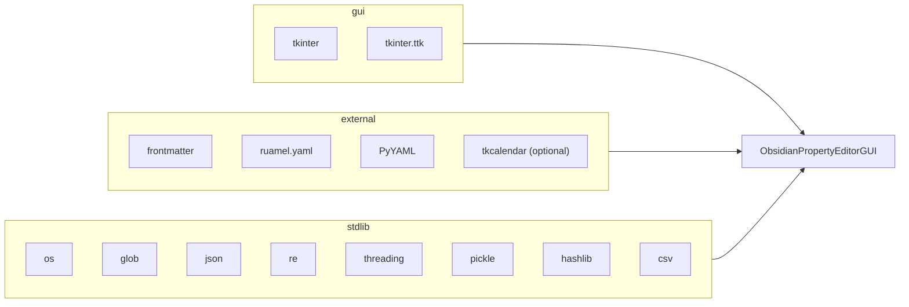
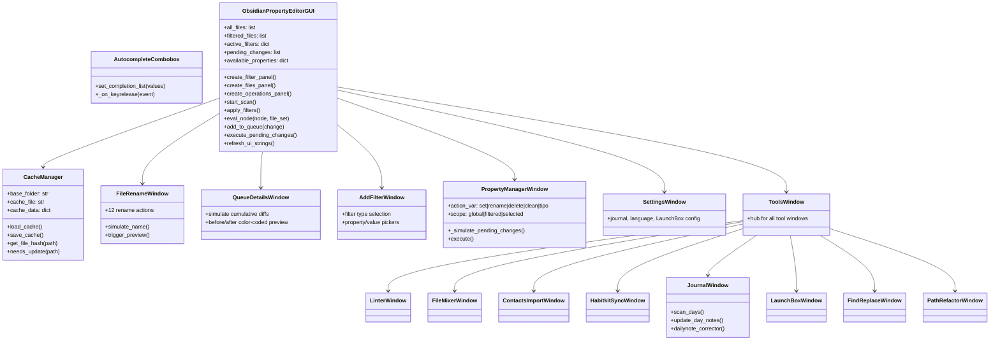
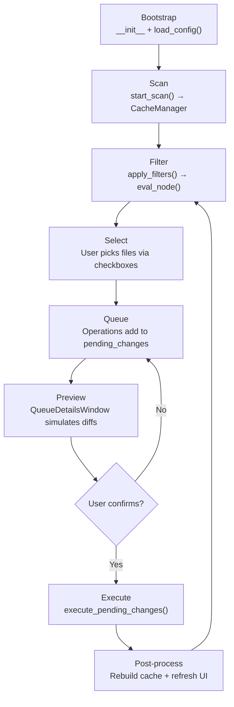

---
Category:
  - "[[Maps]]"
type:
  - about
up:
  - "[[ObsiMan]]"
structure:
  - toc
  - callout
input:
  - AI-gen
AI-Agent:
  - "[[Google Antigravity]]"
  - "[[Claude]]"
dateCreated: 2026-03-07T03:15:00
dateModified: 2026-03-17T17:30:00
description: Mapa completo del código fuente en la versión python. Mostrando sus clases, flujos y diagramas.
---
# PKM Manager — Design & Architecture

> [!abstract] Overview
> `pkm_manager.py` is a monolithic **Tkinter desktop application** (~6,500 lines) for bulk editing [Obsidian](https://obsidian.md) vault metadata. It provides advanced filtering with saved templates, batch property operations, file renaming, a property linter, file merger with data transformations, contact imports, Habitkit sync — all driven by a transactional queue system with diff previews.
>
> This document is the single source of truth for understanding the codebase. Use it as a map for navigating the Python code or as a blueprint for porting to another framework.

---

## 1. File Map

| Line Range | Section | Description |
|---|---|---|
| 1–23 | Imports | stdlib + `frontmatter`, `ruamel.yaml`, `tkcalendar` (optional) |
| 24–762 | `_TRANSLATIONS` + `t()` | Bilingual i18n system (en/es) with 300+ keys |
| 763–1098 | `CacheManager` + R/W helpers | Pickle cache, frontmatter read/write, `rewrite_frontmatter()`, `delete_property()` |
| 1099–1240 | `AutocompleteCombobox` + `DraggableListbox` | Reusable UI widgets |
| 1241–2500 | `ObsidianPropertyEditorGUI` | Main app class — 3-panel layout, filter engine, queue, templates |
| 2501–2900 | `FileRenameWindow` | 12-action batch renaming engine |
| 2901–3100 | `QueueDetailsWindow` | Diff visualizer for pending changes |
| 3100–3500 | `AddFilterWindow` | Dialog for adding filter rules |
| 3500–4900 | `PropertyManagerWindow` | Set/Rename/Delete/Clean/ChangeType for properties |
| 4900–5025 | `SettingsWindow` | Config GUI (journal, language, template management) |
| 5025–5290 | `JournalWindow` + `LaunchBoxWindow` | Daily note sync, LaunchBox converter |
| 5290–5525 | `ContactsImportWindow` | Google Contacts CSV/vCard importer |
| 5525–5760 | `HabitkitSyncWindow` | Habitkit JSON ↔ Obsidian sync |
| 5760–6045 | `FileMixerWindow` | File merger with data transformations |
| 6045–6270 | `LinterWindow` | Property ordering with tabs and drag-drop |
| 6270–6460 | `ToolsWindow` + `FindReplaceWindow` + `PathRefactorWindow` | Tool hub + text tools |

---

## 2. Core Foundations



> [!info] Dependencies
> - **`frontmatter`** + **`ruamel.yaml`** — parse and reconstruct YAML frontmatter without corrupting body content
> - **`pickle`** + **`hashlib`** — persistent file cache (`.obsidian_properties_cache.pkl`) keyed by content hash
> - **`threading`** — background scanning and batch execution so the UI stays responsive
> - **`tkcalendar`** — optional date-picker widget in `PropertyManagerWindow`

---

## 3. Core Data Structures

### 3A. Source of Truth — `self.all_files`

A list of `(path, metadata_dict)` tuples for every scanned file:

```python
[
    ("C:/Vault/Note.md", {"tags": ["idea"], "status": "draft"}),
    ("C:/Vault/Canvas.canvas", {"project": "alpha"})
]
```

### 3B. Filtered View — `self.filtered_files`

A subset of `all_files` containing only files that pass the active filter tree. The file browser TreeView always renders this array.

### 3C. Filter Tree — `self.active_filters`

A recursive boolean tree:

```python
{
    'type': 'group',
    'logic': 'all',       # 'all' (AND) | 'any' (OR) | 'none' (NOT)
    'children': [
        {
            'type': 'rule',
            'property': 'tags',
            'filter_type': 'specific_value',
            'values': ['idea']
        },
        {
            'type': 'group',
            'logic': 'any',
            'children': [...]
        }
    ]
}
```

> [!tip] Filter types
> `has_property`, `missing_property`, `specific_value`, `multiple_values`, `folder`, `folder_exclude`, `file_name`, `file_name_exclude`

Evaluation uses `eval_node()` — recursive set arithmetic (intersection for AND, union for OR, complement for NOT).

### 3D. Pending Changes Queue — `self.pending_changes`

A sequential list of staged operations:

```python
{
    'property': str,           # Property name or '[File Name]'
    'action': str,             # Human-readable description
    'details': str,            # Additional info
    'files': [(path, meta)],   # Target files
    'logic_func': callable,    # fn(path, meta) → updates dict
    'custom_logic': bool       # True = mutates inline; False = returns dict
}
```

> [!warning] Special return keys
> - `_DELETE_PROP` — signals the executor to delete a property after writing
> - `_RENAME_FILE` — signals a file rename instead of property write

### 3E. Property Index — `self.available_properties`

A `defaultdict(set)` mapping every known property name to its set of observed values across the vault. Rebuilt after each scan and queue execution.

---

## 4. Class Hierarchy



---

## 5. UI Layout

```
┌──────────────────────────────────────────────────────────────────┐
│                        PKM Manager                               │
├────────────────┬─────────────────────────┬───────────────────────┤
│  FILTERS       │  FILE BROWSER           │  OPERATIONS           │
│                │                         │                       │
│ [Select Vault] │  [Search Bar]           │ [Properties]          │
│ [Refresh]      │                         │ [Rename Files]        │
│                │  ┌─────────────────┐    │ [Tools]               │
│ Active filters:│  │ ✓ │ File │ # │ Path│ │ [Settings]            │
│ ├─ ALL         │  │───┼──────┼───┼─────│ │                       │
│ │  ├─ rule 1   │  │ ☐ │ Note │ 5 │ +/ │ │ ──────────────────    │
│ │  └─ rule 2   │  │ ☑ │ Post │ 3 │ +/ │ │ Statistics:           │
│ └─ ANY         │  │ ☐ │ Log  │ 2 │ J/ │ │  Total: 1,204         │
│    └─ rule 3   │  └─────────────────┘    │  Shown: 342           │
│                │                         │  Properties: 87       │
│ ────────────── │                         │                       │
│ Pending Queue: │                         │ ──────────────────    │
│  1. Set tags   │                         │ Selected file details  │
│  2. Rename...  │                         │ + pending changes      │
│ [Apply][Clear] │                         │                       │
├────────────────┴─────────────────────────┴───────────────────────┤
│ Status: Ready                                        [Progress]  │
└──────────────────────────────────────────────────────────────────┘
```

> [!note] Panel methods
> - **Column 1**: `create_filter_panel()` — vault controls, filter tree, queue tree
> - **Column 2**: `create_files_panel()` — search bar + sortable TreeView with checkboxes
> - **Column 3**: `create_operations_panel()` — action buttons, statistics, file detail viewer

---

## 6. Execution Lifecycle



> [!important] Threading model
> - **Scan** runs in a background thread; UI updates via `root.after()`
> - **Queue execution** also runs in a background thread with a `threading.Lock()`
> - The scan lock (`_scan_lock`) prevents concurrent scans

---

## 7. I18N System

The bilingual system lives in lines 24–643:

- **`_TRANSLATIONS`** — nested dict keyed by language code (`en`, `es`), then by dotted key (e.g., `app.title`, `btn.apply_changes`)
- **`t(key, **kwargs)`** — lookup function with `str.format()` support and English fallback
- **`set_language(lang)`** / **`get_available_languages()`** — runtime language switching
- **`refresh_ui_strings()`** — called after language change to update all widget labels

> [!example] Usage
> ```python
> label.config(text=t("btn.apply_changes"))
> status_msg = t("msg.files_found", count=42)
> ```

---

## 8. Cache System — `CacheManager`

| Method | Purpose |
|---|---|
| `load_cache()` | Reads `.obsidian_properties_cache.pkl` from vault root |
| `save_cache()` | Writes updated cache back to disk |
| `get_file_hash(path)` | SHA-256 of file content for change detection |
| `needs_update(path)` | Compares stored hash vs current — skips clean files |

The cache stores per-file: `path`, `hash`, `mtime`, `metadata dict`. On scan, only modified files are re-parsed — making repeat scans fast even on large vaults.

> [!tip] Supported file types
> `.md` (YAML frontmatter), `.canvas` (JSON with nested metadata), `.excalidraw` (YAML frontmatter + drawing content)

---

## 9. Sub-Module Windows

### 9A. PropertyManagerWindow (line 3462)

The most complex dialog. Operates on selected files with five actions:

| Action | Description |
|---|---|
| **Set** | Create or overwrite a property value |
| **Rename** | Rename a property key (delete old + write new) |
| **Delete** | Remove a property from files |
| **Clean** | Remove empty/null properties |
| **Change Type** | Convert property to text/number/checkbox/list/date |

Features:
- **Dual targeting**: operate on property keys or individual list values
- **Type inference**: auto-detects property type from data, shows appropriate widget
- **Pending preview**: `_simulate_pending_changes()` shows cumulative future state with color-coded diffs (green=added, red=deleted)
- **Options**: format as `[[wikilink]]`, include time, replace lists vs append, reformat values

### 9B. FileRenameWindow (line 2442)

A 12-action batch renaming engine inspired by Ant Renamer:

1. Change Extension, 2. String Replace, 3. Multi Replace, 4. String Insert, 5. Move String, 6. Character Delete, 7. Enumeration, 8. Date/Time, 9. Random, 10. Change Case, 11. From List, 12. Regex

Each action has saved defaults in `pkm_manager_config.json` under `rename_defaults`.

### 9C. QueueDetailsWindow (line 2853)

Performs a `copy.deepcopy` dry-run of all pending changes and renders before/after diffs per file. Color-coded: ==green== for added, ~~red~~ for deleted, gray for unchanged.

### 9D. AddFilterWindow (line 3046)

Dialog for creating individual filter rules. Offers property/value pickers with autocomplete from `available_properties`.

### 9E. JournalWindow (line 4531)

Daily note management:
- Scans journal folder for notes matching `logType: [[Day]]`
- Syncs chronological nav properties (`date`, `prev`, `next`, `week`)
- Links orphan event log files into their daily note's `### Records` section
- All changes go through the queue system

### 9F. ToolsWindow (line 4797)

Hub menu that launches: [[#9E. JournalWindow|Journal]], [[#LaunchBoxWindow|LaunchBox]], [[#FindReplaceWindow|Find & Replace]], [[#PathRefactorWindow|Path Refactor]]

### 9G. ContactsImportWindow (line 5293)

Google Contacts importer (CSV / vCard):
- Parses `.csv` (via `csv.DictReader`) and `.vcf` (simple line-based parser for FN, TEL, EMAIL, ORG, etc.)
- Builds a dynamic field mapping UI: each source field → skip / filename / property
- Auto-detects name fields for filename mapping
- Creates one `.md` file per contact with YAML frontmatter
- Does **not** use the queue (writes directly)

### 9H. HabitkitSyncWindow (line 5526)

Bidirectional sync between Habitkit JSON exports and Obsidian daily notes:
- Parses Habitkit export JSON (`habits`, `completions`, `categories`, `categoryMappings`)
- Maps each habit to an Obsidian property name (with autocomplete)
- Direction selector: HK→Obs, Obs→HK, bidirectional
- Finds daily notes via `logType` matching
- **Uses the queue** — queues per-date property updates

### 9I. LinterWindow (line 6046)

Property ordering tool with template-based tabs:
- Default tab applies to all files (or filtered set)
- Template tabs apply to files matching a filter template
- `DraggableListbox` with numbered entries for drag-and-drop reordering
- `AutocompleteCombobox` for adding properties
- Closeable tabs (✕ on template tab labels)
- **Uses the queue** — queues `_REORDER_ALL` operations
- Persists order in `rename_defaults._linter_orders`

### 9J. FileMixerWindow (line 5764)

File merger with data transformations:
- Reorderable file list via `DraggableListbox`
- Conflict resolution: merge lists / keep first / keep last
- **Data transformations**: property→value, value→property, filename→property
- Live preview with color-coded frontmatter/body
- Output to first file or new file, with optional archiving
- **Uses the queue** — queues merge + archive operations

### 9K. Other Windows

- **LaunchBoxWindow** — spawns `lb_xml_to_md.py` / `lb_to_md_urls.py` as subprocesses
- **FindReplaceWindow** — deep regex search-and-replace in file body content (direct write)
- **PathRefactorWindow** — path string substitution across the vault (direct write)
- **SettingsWindow** — GUI for `pkm_manager_config.json` (journal, language, LaunchBox, template management)

---

## 10. Configuration

Stored in `Production/Code/pkm_manager_config.json`:

```json
{
    "last_vault": "C:/path/to/vault",
    "journal_folder": "Journal",
    "journal_logtype": "[[Day]]",
    "journal_calc_nav": true,
    "launchbox_out_dir": "+",
    "rename_defaults": {},
    "language": "en"
}
```

Loaded in `load_config()`, saved in `save_config()`. The `rename_defaults` key stores per-action saved parameters indexed by action number.

---

## 11. Key Patterns & Conventions

> [!warning] Bilingual codebase
> The code was originally written in Spanish and translated to English in March 2026. Some internal references, variable comments, and UI strings still mix both languages. The i18n layer (`t()`) handles user-facing text.

- **Queue-first execution**: all operations stage into `pending_changes` before applying — nothing writes directly to disk without user confirmation
- **Set arithmetic for filtering**: `eval_node()` uses Python `set()` intersection/union/complement for efficient boolean logic
- **`logic_func` pattern**: each queued change carries a callable that receives `(path, metadata)` and returns an updates dict (or mutates inline if `custom_logic=True`)
- **Thread safety**: scan and execution each acquire `_scan_lock`; UI updates always go through `root.after()`
- **File encoding**: always `encoding='utf-8'` for reading/writing markdown files

---

## 12. Extension Points

To add a new tool window:

1. Create a `class NewToolWindow` inheriting from nothing (uses `tk.Toplevel` in `__init__`)
2. Accept `parent` (the main `ObsidianPropertyEditorGUI` instance) to access `all_files`, `filtered_files`, `available_properties`, `add_to_queue()`
3. Add a button in `ToolsWindow` that calls `NewToolWindow(self.parent)`
4. Add i18n keys for all user-facing strings in both `en` and `es` sections of `_TRANSLATIONS`
5. Add the window to `refresh_ui_strings()` if it persists across language changes
